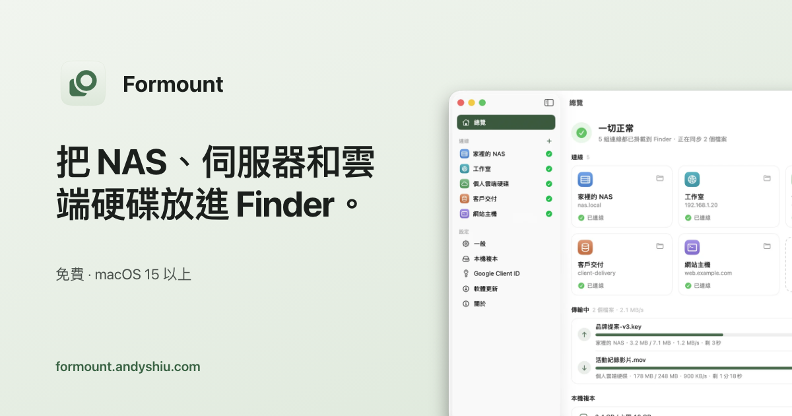
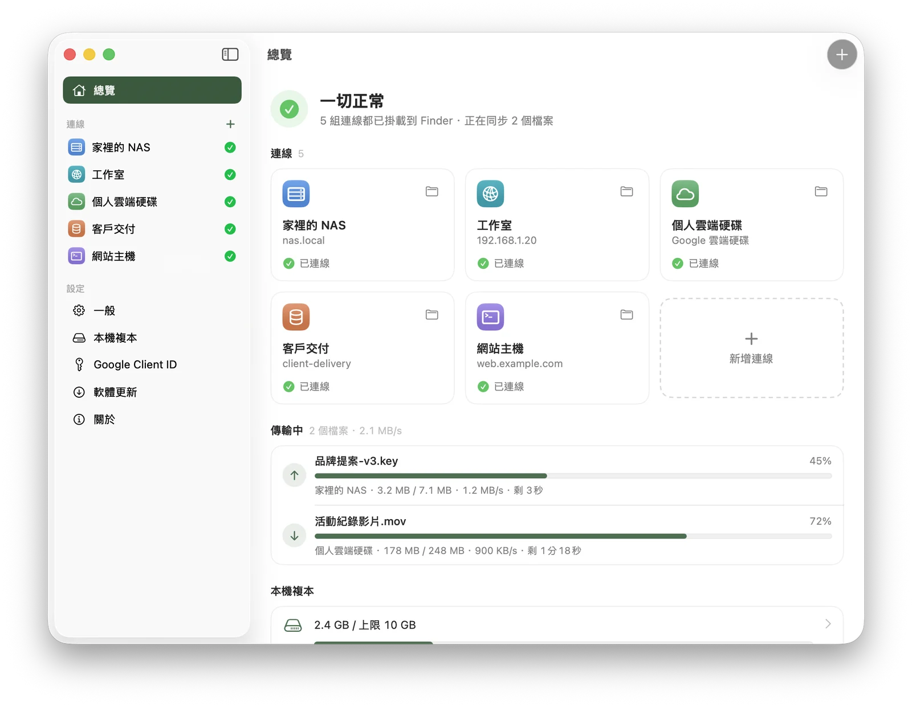

# Formount

把 NAS、伺服器和雲端硬碟**掛載到 Finder**,用起來和本機資料夾一樣:直接打開、拖放、存檔、用任何 App 編輯。不用開網頁、不用另外的同步程式,也不用把整個雲端硬碟下載到電腦裡。

官網:[formount.andyshiu.com](https://formount.andyshiu.com)

**這個 repo 只放安裝檔與自動更新資訊**,程式碼未公開。

| | |
|---|---|
| 價格 | 免費 |
| 下載 | [Formount.dmg(最新版)](../../releases/latest/download/Formount.dmg) |
| 需求 | macOS 15 Sequoia 以上,Apple 晶片與 Intel 皆可 |
| 語言 | 繁體中文、English、简体中文、日本語、한국어 |

---

## 下載與安裝

1. [下載最新版](../../releases/latest/download/Formount.dmg),或到 [Releases](../../releases) 頁面選擇版本
2. 打開 `Formount.dmg`,把 Formount 拖到「應用程式」資料夾
3. 打開 Formount,「開始使用」會帶你新增第一組連線,並在系統設定中打開 Formount(macOS 規定要由使用者親自打開一次)
4. Finder 側邊欄的「位置」下方會出現「Formount - 連線名稱」

App 已經過 Apple 公證,下載後可以直接開啟。之後會自動更新,裝一次就好。

> `Formount.zip` 與 `appcast.xml` 是 App 自動更新用的,一般安裝請下載 `Formount.dmg`。

## 支援的服務

| 類別 | 服務 |
|---|---|
| NAS 與伺服器 | WebDAV(Synology、QNAP、Nextcloud 等)、SMB(網路芳鄰)、SFTP、FTP / FTPS |
| 雲端硬碟 | Google 雲端硬碟、OneDrive、Dropbox |
| 物件儲存 | S3 相容儲存(AWS S3、Cloudflare R2、Wasabi、MinIO) |

## 功能

- **就在 Finder 裡**:使用 Apple 官方的 File Provider(和 iCloud 雲碟相同),不用安裝 macFUSE、不用降低系統安全性
- **不佔硬碟空間**:檔案打開時才下載,一段時間沒用的會自動清理,檔案仍留在 Finder
- **斷線也不怕**:網路中斷不會卡住 Finder,恢復後自動重新連線;開機後自動掛載
- **遠端變更自動同步**:別人新增、修改、刪除的檔案會出現在 Finder;兩邊同時修改時保留兩份
- **選單列面板**:隨時查看每組連線的狀態、傳輸進度與衝突
- **安全**:密碼與登入資料只存在你的 Mac(加密設定檔與鑰匙圈),直接連到你的儲存空間,不經過第三方

## 問題回報

使用上的問題或建議,請到 [Issues](../../issues) 開議題單。

隱私權政策:[formount.andyshiu.com/privacy.html](https://formount.andyshiu.com/privacy.html)

---

由台灣獨立開發者 AndyShiu 製作。名字來自 Formosa(福爾摩沙)+ mount(掛載)。
